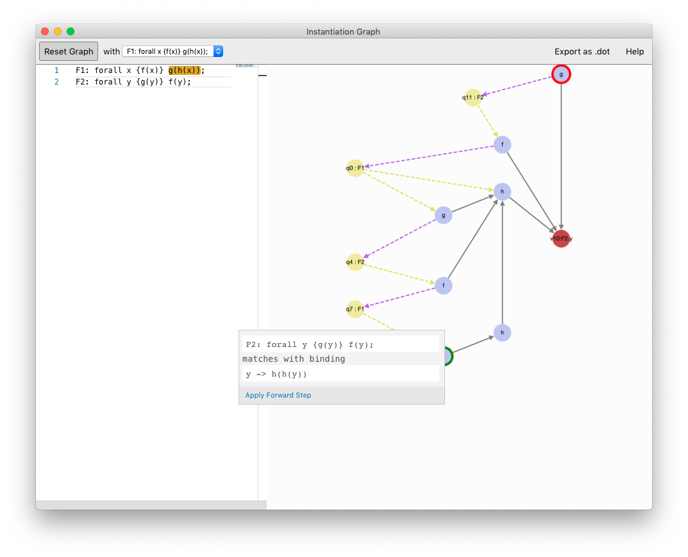

# Analysis Tool for Quantifier Instantiation Behaviour




[Download Latest Release](https://github.com/lbeurerkellner/quantifier-analysis/releases)

This repository contains the implementation of an interactive construction editor for abstract instantiation graphs (AIG). AIGs can be used to model and analyse the instantiation behaviour of SMT solvers which implement universally quantified formulas using E-Matching \[1\]. This allows to reason and debug performance issues that may arise due to matching loops during quantifier instantiation.

## Building

The editor is implemented using TypeScript and the React.js library. To get a local development environment running, execute the following commands:

```shell
yarn install # install dependencies
yarn run start # start development server
```

> See here for the Yarn Package Manager: https://yarnpkg.com

### Web Builds

For a web-based production build run the following commands in the top-level project.

```shell
yarn install # install dependencies
yarn run build # outputs a production web-build to subfolder build/
```

### Desktop Builds

To package the application as a desktop app, run the following commands.

```shell
cd desktop/
yarn install # install desktop-app dependencies
yarn build # packages react application into webpack optimised bundle
yarn dist # outputs production desktop-builds to the desktop/dist/ subfolder
```

## References

\[1\] De Moura, Leonardo, and Nikolaj Bjørner. "Efficient E-matching for SMT solvers." International Conference on Automated Deduction. Springer, Berlin, Heidelberg, 2007.
